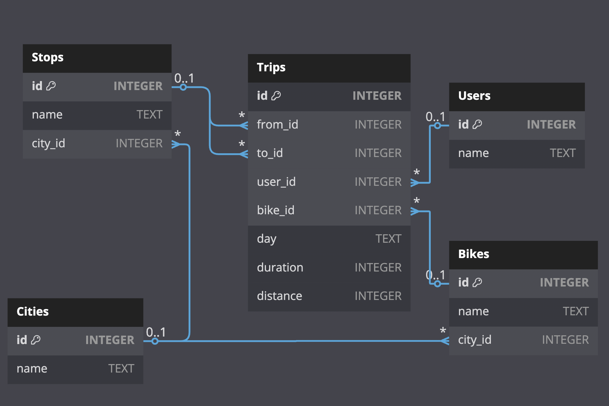
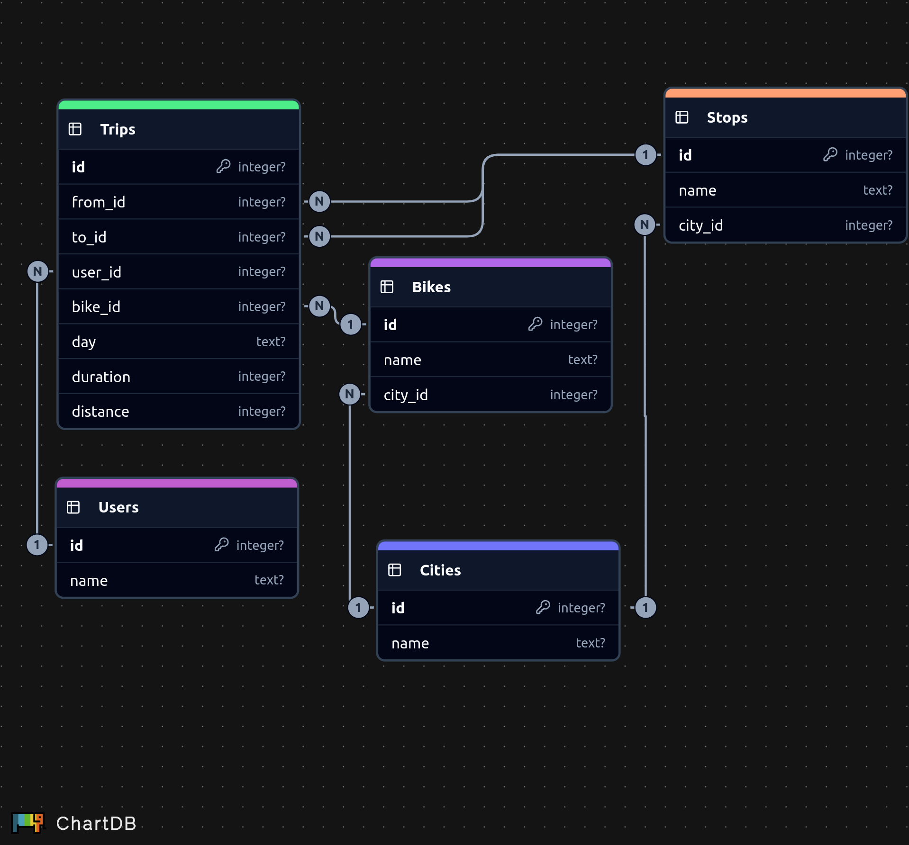

## [Task 1: Database programming](https://tasks.withmooc.fi/tikape-kevat-2025/1)

The existing database contains information about city bikes and trips made on them. The SQL schema of the database is as follows:

```sql
CREATE TABLE Bikes (
    id INTEGER PRIMARY KEY,
    name TEXT,
    city_id INTEGER REFERENCES Cities(id)
);

CREATE TABLE Cities (
    id INTEGER PRIMARY KEY,
    name TEXT
);

CREATE TABLE Stops (
    id INTEGER PRIMARY KEY,
    name TEXT,
    city_id INTEGER REFERENCES Cities(id)
);

CREATE TABLE Trips (
    id INTEGER PRIMARY KEY,
    from_id INTEGER REFERENCES Stops(id),
    to_id INTEGER REFERENCES Stops(id),
    user_id INTEGER REFERENCES Users(id),
    bike_id INTEGER REFERENCES Bikes(id),
    day TEXT,
    duration INTEGER, -- minutes
    distance INTEGER -- meters
);

CREATE TABLE Users (
    id INTEGER PRIMARY KEY,
    name TEXT
);
```





You can download the database as an SQLite file [here](https://cs.helsinki.fi/u/ahslaaks/tikape/bikes.db) . You can explore the database in an SQLite interpreter to get a better idea of ​​its contents. The database describes trips in June 2021, and the database content has been randomly generated for this task. For creating ER Diagrams refer to [dbdiagram](https://dbdiagram.io/home) or [ChartDB](https://chartdb.io/)


Your task is to write a module in Python bikes.pythat provides the following functions:  
- distance_of_user(user)reports the total distance traveled by the user. (2 points)
- speed_of_user(user)reports the user's average speed (km/h) over all trips to two decimal places. (2 points)
- duration_in_each_city(day)Report for each city how long people cycled on a given day. (3 points)
- users_in_city(city)indicates how many different users have been on bikes in a given city. (2 points)
- trips_on_each_day(city)For each day, state how many trips have been made on that day. (3 points)
- most_popular_start(city)indicates the most popular starting point in the city for the trip and the number of trips (if there are several options, the last one in alphabetical order is chosen). (3 points)


You can use the following module main.pyto help you implement the module:
```python
import bikes

print("Test 1:", bikes.distance_of_user("ocuber"))
print("Test 2:", bikes.speed_of_user("ocuber"))
print("Test 3:", bikes.duration_in_each_city("2021-06-01"))
print("Test 4:", bikes.users_in_city("laeserii"))
print("Test 5:", bikes.trips_on_each_day("laeserii"))
print("Test 6:", bikes.most_popular_start("laeserii"))
```

The output of the program should be as follows:  
```bash
Test 1: 54320
Test 2: 16.21
Test 3: [('anddesen', 59354), ('anpoan', 59296), ('baphoetron', 58655), ('beriifo', 59749), ('laeserii', 59470), ('maller', 60947), ('miboo', 57403), ('nonraemo', 59829), ('selatan', 57488), ('triamal', 59925)]
Test 4: 43246
Test 5: [('2021-06-01', 3403), ('2021-06-02', 3406), ('2021-06-03', 3216), ('2021-06-04', 3360), ('2021-06-05', 3416), ('2021-06-06', 3243), ('2021-06-07', 3336), ('2021-06-08', 3335), ('2021-06-09', 3429), ('2021-06-10', 3297), ('2021-06-11', 3351), ('2021-06-12', 3316), ('2021-06-13', 3362), ('2021-06-14', 3370), ('2021-06-15', 3298), ('2021-06-16', 3405), ('2021-06-17', 3164), ('2021-06-18', 3324), ('2021-06-19', 3356), ('2021-06-20', 3280), ('2021-06-21', 3293), ('2021-06-22', 3332), ('2021-06-23', 3303), ('2021-06-24', 3403), ('2021-06-25', 3308), ('2021-06-26', 3317), ('2021-06-27', 3338), ('2021-06-28', 3441), ('2021-06-29', 3262), ('2021-06-30', 3357)]
Test 6: ('riirande', 1077)
```

Video related to the task:
- [Tikape Task 1: Instructions (especially for Windows users)](https://www.youtube.com/watch?v=LIEoIR5s0wc)

### Review

The following module main.pytests your module bikes.pyfor review. Note that the functions are called differently here than in the example above.  
```python
import bikes 

print("Test 1:", bikes.distance_of_user("eba")) 
print("Test 2:", bikes.speed_of_user("eba")) 
print("Test 3:", bikes.duration_in_each_city("2021-06-15")) 
print("Test 4:", bikes.users_in_city("anddesen")) 
print("Test 5:", bikes.trips_on_each_day("anddesen")) 
print("Test 6:", bikes.most_popular_start("anddesen"))
```

[main.py](./test/main.py) Write the output produced by the module and the source code of the module in the boxes below [bikes.py](./test/bikes.py). You will receive points in the review for each function that produces the correct result. If you have not implemented a function, you can comment on that line in the main program.

**Module [`main.py`](./main.py) printing**
```bash
Test 1: 82961
Test 2: 14.18
Test 3: [('anddesen', 56916), ('anpoan', 58185), ('baphoetron', 59323), ('beriifo', 58037), ('laeserii', 58244), ('maller', 58484), ('miboo', 59774), ('nonraemo', 56492), ('selatan', 57495), ('triamal', 57479)]
Test 4: 43167
Test 5: [('2021-06-01', 3356), ('2021-06-02', 3275), ('2021-06-03', 3329), ('2021-06-04', 3228), ('2021-06-05', 3287), ('2021-06-06', 3315), ('2021-06-07', 3345), ('2021-06-08', 3319), ('2021-06-09', 3262), ('2021-06-10', 3335), ('2021-06-11', 3328), ('2021-06-12', 3314), ('2021-06-13', 3349), ('2021-06-14', 3337), ('2021-06-15', 3254), ('2021-06-16', 3392), ('2021-06-17', 3302), ('2021-06-18', 3345), ('2021-06-19', 3318), ('2021-06-20', 3434), ('2021-06-21', 3328), ('2021-06-22', 3198), ('2021-06-23', 3316), ('2021-06-24', 3319), ('2021-06-25', 3404), ('2021-06-26', 3303), ('2021-06-27', 3332), ('2021-06-28', 3399), ('2021-06-29', 3328), ('2021-06-30', 3388)]
Test 6: ('manluslo', 1075)
```

**Module [`bikes.py`](./bikes.py) source code**
```python
import sqlite3

db = sqlite3.connect('bikes.db')
db.isolation_level=None

def distance_of_user(user):
    '''
    Reports the total distance traveled by the user. (2 points)
    '''
    sql_query = '''
        SELECT SUM(t.distance)
        FROM trips t
        JOIN users u ON t.user_id = u.id
        WHERE u.name = ?
        '''
    result = db.execute(sql_query, [user]).fetchone()
    return result[0]

def speed_of_user(user):
    '''
    Reports the user's average speed (km/h) over all trips to two 
    decimal places. (2 points)
    '''
    sql_query = '''
        SELECT ROUND((SUM(t.distance)*60.0) / (SUM(t.duration)*1000), 2)  --since time in minutes
        FROM trips t
        JOIN users AS u ON t.user_id = u.id
        GROUP BY u.name
        HAVING u.name = ?
        '''
    result = db.execute(sql_query, [user]).fetchone()
    return result[0]

    
def duration_in_each_city(day):
    '''
    Report for each city how long people cycled on a given day. (3 points)
    '''
    sql_query = '''
        SELECT c.name, SUM(t.duration)
        FROM trips t
        JOIN stops s ON t.from_id = s.id
        JOIN cities c ON s.city_id = c.id
        WHERE t.day = ?
        GROUP BY c.name
        ORDER BY c.name 
        '''
    result = db.execute(sql_query, [day]).fetchall()
    return result

def users_in_city(city):
    '''
    indicates how many different users have been on bikes in a 
    given city. (2 points)
    '''
    sql_query = '''
        SELECT COUNT(DISTINCT t.user_id)
        FROM trips t
        JOIN stops s ON t.from_id = s.id
        JOIN cities c ON s.city_id = c.id
        WHERE c.name = ?
        '''
    result = db.execute(sql_query, [city]).fetchone()
    return result[0]


def trips_on_each_day(city):
    '''
    For each day, state how many trips have been made on that day.
    (3 points)
    '''
    sql_query = '''
        SELECT t.day, COUNT(DISTINCT t.id)
        FROM trips t
        JOIN stops s ON t.from_id = s.id
        JOIN cities c ON s.city_id = c.id
        WHERE c.name = ?
        GROUP BY t.day
        ORDER BY t.day
        '''
    result = db.execute(sql_query, [city]).fetchall()
    return result


def most_popular_start(city):
    '''
    Indicates the most popular starting point in the city for the
    trip and the number of trips (if there are several options, the
    last one in alphabetical order is chosen). (3 points)
    '''
    sql_query = '''
        SELECT s.name, COUNT(t.id)
        FROM trips t
        JOIN stops s ON t.from_id = s.id
        JOIN cities c ON s.city_id = c.id
        WHERE c.name = ?
        GROUP BY s.name
        ORDER BY COUNT(t.id) DESC, s.name DESC
        LIMIT 1
        '''
    result = db.execute(sql_query, [city]).fetchone()
    return result
```